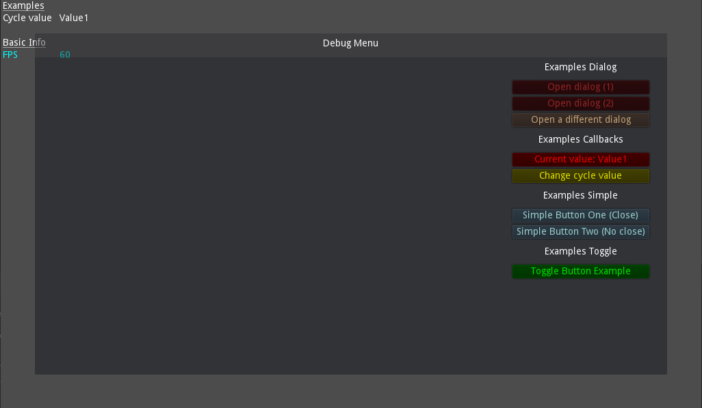

# GodotCSharpToolkit

This is a collection of useful tools that you can use to quickstart your godot projects.
Check [my youtube](https://www.youtube.com/channel/UCM0mBdsjKQ78eGBSSpnQGuQ) for related tutorial videos. If you got any questions check [my discord](https://discord.gg/CXfYFvWWer).

## License
Use as you see fit, just please attribute credits accordingly if you distribute the code. Also please don't attempt to resell this code like an ass. If you make improvements it is appreciated if you create pull requests so they can be integrated back into the main repository.

## Notes
* Some of the features require [Newtonsoft Json](https://www.nuget.org/packages/Newtonsoft.Json/).
* The toolkit comes with an additional tool I made called the CSharpDataEditor, this is a easy to use editor for your data classes. Great for prototyping. (video coming soon)
* Everything is in the GodotCSharpToolkit namespace.

## Installation

No matter which method you use, make sure the folder you install it into is called **GodotCSharpToolkit** and is in the root directory of your godot project. Make sure there are no additional subfolders inside this folder before the files in this repo, else you will have issues. If you name it anything else you will have to update all script references inside the .tscn files in this repository.

If you did this correctly the path to this file (readme.md) should be **\<your game project>/GodotCSharpToolkit/readme.md**

### Step 1 - Autoloads
Once you have done this you need to setup two autoloads [res://GodotCSharpToolkit/DebugMenu/DebugMenu.tscn](DebugMenu/DebugMenu.tscn) and [res://GodotCSharpToolkit/ToolkitLoader.cs](ToolkitLoader.cs). Set them up in that order and also add a loading scene as the ToolkitLoader requires one frame to pass before all the autoloads it adds for you will process. Optionally you can also look inside the ToolkitLoader and simply add the individual classes as autoloads.

### Step 2 - Toolkit settings
The second thing you need to do is implement the [res://GodotCSharpToolkit/Misc/IToolkitSettings.cs](Misc/IToolkitSettings.cs) interface. This is to provide paths for the toolkit to work properly. Please check the interface for instructions. It does not matter where you implement this, the toolkit will search your binary for an interface implementation. The class must have a constructor without arguments though. The loading method is in [Utils.GetToolkitSettings()](Misc/Utils.cs) in case you want to see how it is loaded.

### Submodule / Subrepository
The easiest way to install the GodotCSharpToolkit is to include it as a submodule inside your main game repository. If you use [Source Tree](https://www.sourcetreeapp.com/) then you can find [instructions on how to do so here](https://confluence.atlassian.com/sourcetreekb/adding-a-submodule-subtree-with-sourcetree-785332086.html).

**Note: I strongly advice to fork this repository and include your fork as the submodule, this way you can add your own changes easier.**

### Zip
The second option would be to simply press the green "Code" button that you can find near the top of this page, then select download as ZIP. Simply extract it into the root of your godot game directory then rename the folder to **GodotCSharpToolkit**.

## Features
Below you can find a list of features and instructions on how to use these features. If you got any questions please open a ticket or ask in [my discord](https://discord.gg/CXfYFvWWer). 

### Event System

Probably the most powerful and useful feature of the framework. A very simple to use event system that helps you easily create multiplayer games without much fuss. Does require some setup and has a few tradeoffs but well worth it for small game projects and prototypes.

* **Autoload File:** [res://GodotCSharpToolkit/EventSystem/EventManager.cs](EventSystem/EventManager.cs)
* **Namespace:** GodotCSharpToolkit.EventSystem
* **Instructions:** See video
* **Video Tutorial:** N/A (coming soon)
* **Notes:** See video

### Debug Menu

A debug menu controlled by simple annotations. You can see examples of all annotations in the [DebugMenuExample](DebugMenu/Example/DebugMenuExample.cs) class. The screenshot below is of how the menu looks with only the example active. To use simply add the autoload to your godot project (make sure you load the .tscn file not the .cs file).

The debug menu will only run while in debug mode, it checks for *OS.IsDebugBuild()* and does a *QueueFree()* on itself if not in debug mode.

The DebugMenu also comes with an **on screen debug** (default has FPS counter, but you can add anything you want). In addition there is also **debug tools** which are simple class files that inherit from a specific interface. All debug tools are resolved by reflection on startup and executed on every game startup.

* **Autoload File:** [res://GodotCSharpToolkit/DebugMenu/DebugMenu.tscn](DebugMenu/DebugMenu.tscn)
* **Namespace:** GodotCSharpToolkit.DebugMenu
* **Instructions:** Look in class [res://GodotCSharpToolkit/DebugMenu/Example/DebugMenuExample.cs](DebugMenu/Example/DebugMenuExample.cs)
* **Video Tutorial:** N/A
* **Notes:** Press *F12* to open the debug menu. Press *F11* to open the onscreen debug.

### Extension Methods

Various [extension methods](Extensions/) are included in the project, I keep adding new ones whenever I write something useful. Feel free to open pull requests for anything useful you got.

* **Autoload File:** N/A
* **Namespace:** GodotCSharpToolkit.Extensions
* **Instructions:** Simply include the namespace to use.
* **Video Tutorial:** N/A

### Logger

Simple to use logger, that includes a [GD.print logger](Logging/LogGDPrint.cs) and log levels. Easy to extend with your own loggers.

* **Autoload File:** N/A
* **Namespace:** GodotCSharpToolkit.Logging
* **Instructions:** To start using after autloads have been loaded simply call *Logger.AddLogger(new LogGDPrint(LogLevel.Trace));*
* **Video Tutorial:** N/A

### Misc

The [misc](Misc/) folder includes various useful things. Constants, interfaces, util classes, etc... You can have a look at the [utils](Misc/Utils.cs) class for some examples

* **Autoload File:** N/A
* **Namespace:** GodotCSharpToolkit.Misc
* **Instructions:** Simply include the namespace to use.
* **Video Tutorial:** N/A
